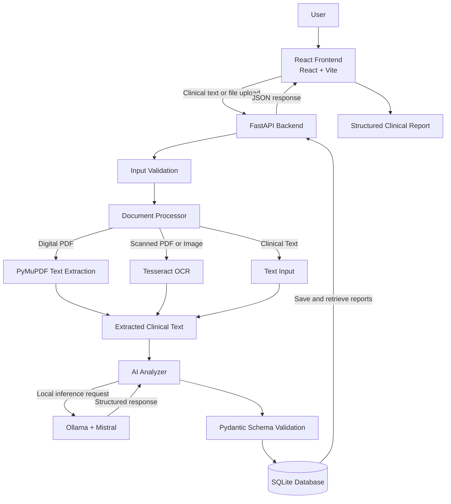

# System Architecture — AI Clinical Document Reviewer

## 1. Overview

The AI Clinical Document Reviewer is a web application that extracts information from clinical documents, generates structured reports using a locally running language model, and stores reports for later retrieval.

The application follows a client-server architecture consisting of a React frontend, a FastAPI backend, document processing services, an Ollama-hosted Mistral model, and an SQLite database.

## 2. Architecture Diagram

## 3. Frontend Layer

**Technology:** React, Vite, JavaScript, CSS

The frontend provides the user interface for interacting with the application.

Responsibilities include:

- Accepting clinical text from users.
- Allowing supported document uploads.
- Sending requests to the backend API.
- Displaying generated clinical reports.
- Showing loading, success, and error states.
- Displaying previously generated reports through the history interface.

The frontend communicates with the backend through HTTP requests and receives JSON responses.

## 4. Backend Layer

**Technology:** Python, FastAPI

The backend coordinates document processing, AI analysis, data validation, and report storage.

### Main application

`backend/app/main.py`

Initializes the FastAPI application, initializes the database at startup, and registers the document router.

### API router

`backend/app/routers/documents.py`

Handles the application's HTTP endpoints:

- `POST /analyze/text`
- `POST /analyze/file`
- `GET /reports`
- `GET /reports/{report_id}`

The router validates requests, coordinates processing, and returns appropriate HTTP responses.

## 5. Document Processing Layer

**File:** `backend/app/services/document_processor.py`

This component extracts text from supported documents.

### Digital PDFs

PyMuPDF extracts selectable text directly from PDF pages.

### Scanned PDFs

When a PDF page does not contain extractable text, the page is rendered as an image and processed through OCR.

### Image documents

Pillow prepares image input, while pytesseract invokes Tesseract OCR to extract text.

The extracted text is passed to the AI analyzer.

## 6. AI Analysis Layer

**File:** `backend/app/services/ai_analyzer.py`

The AI analyzer prepares the extracted text, constructs the analysis prompt, and sends the request to the locally running Mistral model through Ollama.

The model is used to identify and organize information such as:

- Patient information
- Symptoms
- Diagnoses or recorded labels
- Medications
- Vital signs
- Allergies
- Observations
- Concerns
- Missing information
- Inconsistencies
- Review notes

The analyzer also contains specialized processing for synthetic clinical datasets.

AI-generated information may be incomplete or inaccurate. The system therefore marks reports as requiring clinician review.

## 7. Data Validation Layer

**File:** `backend/app/schemas/clinical_report.py`

Pydantic models define the expected structure of the generated report.

The schema includes patient information, summary text, lists of clinical findings, and a clinician-review flag.

Schema validation helps ensure that the generated output follows the expected data structure before it is returned or stored.

Schema validation does not guarantee that the clinical information itself is factually correct.

## 8. Database Layer

**File:** `backend/app/services/report_storage.py`

**Technology:** SQLite

SQLite stores generated reports in:

`backend/clinical_reports.db`

The storage component is responsible for:

- Initializing the database.
- Saving generated reports.
- Retrieving report history.
- Retrieving an individual report by its identifier.

This allows previously generated reports to remain available after the backend restarts, provided the database file is retained.

## 9. End-to-End Data Flow

1. A user enters clinical text or selects a supported file.
2. The React frontend sends the input to the FastAPI backend.
3. The backend validates the request, file type, and file size.
4. The document processor extracts text using PyMuPDF or OCR where appropriate.
5. The AI analyzer sends the extracted text to Mistral through Ollama.
6. The generated response is validated against the Pydantic report schema.
7. The report is saved in SQLite.
8. The backend returns the report to the frontend as JSON.
9. The frontend renders the structured report.
10. When requested, the backend retrieves stored reports for the history interface.

## 10. Error Handling

The backend handles common failures, including:

- Unsupported file types.
- Empty uploads or invalid input.
- Files exceeding the upload limit.
- PDF or image extraction failures.
- AI inference failures.
- Database storage or retrieval failures.

Errors are returned through HTTP responses so that the frontend can display appropriate feedback.

## 11. Security and Privacy Considerations

- Use synthetic or appropriately de-identified clinical data during development.
- Do not expose the backend API publicly without authentication and appropriate access controls.
- Protect the SQLite database because stored reports may contain sensitive information.
- Validate uploaded files and limit upload sizes.
- Verify AI-generated output against the original clinical document.
- Do not treat model output as a confirmed diagnosis or treatment recommendation.

## 12. Known Limitations

- OCR accuracy depends on document quality and layout.
- Language model output may omit, misinterpret, or incorrectly organize clinical information.
- Pydantic validation checks structure, not medical correctness.
- The current Tesseract configuration uses a Windows-specific path.
- Local inference requires Ollama to be installed and running.
- Production deployment would require additional security, monitoring, and persistent storage configuration.