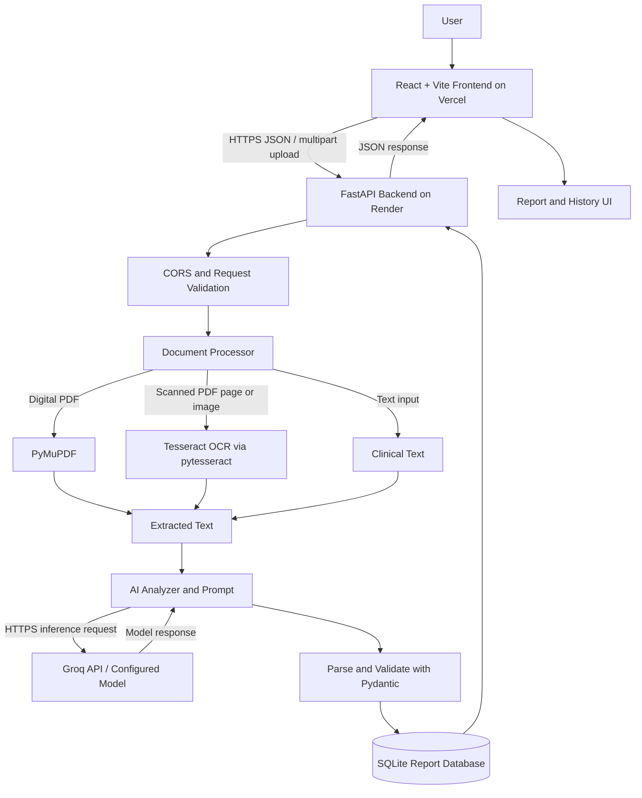

# System Architecture — AI Clinical Document Reviewer

## 1. Overview

The application follows a client-server architecture. A React/Vite frontend communicates with a FastAPI backend. The backend validates input, extracts document text, calls the Groq hosted inference API, validates the generated report with Pydantic, and stores report content and metadata in SQLite.

## 2. Deployed Components

- **Frontend:** https://ai-clinical-document-reviewer-xi.vercel.app/
- **Backend API:** https://ai-clinical-document-reviewer-pb0o.onrender.com
- **API documentation:** https://ai-clinical-document-reviewer-pb0o.onrender.com/docs
- **Inference provider:** Groq API, configured by `GROQ_MODEL`
- **Storage:** SQLite file on the backend filesystem

## 3. Architecture Diagram

## 4. Frontend Layer

**Files:** `frontend/src/App.jsx`, `frontend/src/App.css`

The frontend accepts clinical text or supported documents, calls the backend, displays loading and error states, renders structured reports, and requests report history and individual report details. It reads the API base URL from `VITE_API_URL`, with a local-development fallback.

## 5. API and Orchestration Layer

**File:** `backend/app/main.py`

FastAPI initializes the application, configures CORS for local development and the deployed Vercel origin, initializes SQLite on startup, and registers the document router.

**File:** `backend/app/routers/documents.py`

The router handles `POST /analyze/text`, `POST /analyze/file`, `GET /reports`, and `GET /reports/{report_id}`. File uploads are restricted by extension, content type, and a 10 MB maximum size. Supported types include PDF, PNG, JPG, JPEG, and WEBP.

## 6. Document Processing Layer

**File:** `backend/app/services/document_processor.py`

- Digital PDFs: PyMuPDF extracts selectable text page by page.
- Scanned PDFs: pages without selectable text are rendered and sent through OCR.
- Images: Pillow normalizes image orientation and converts images to RGB before pytesseract invokes Tesseract.
- OCR configuration: `TESSERACT_CMD` can set the executable path; common Windows configuration and Linux PATH discovery are supported.

OCR can introduce transcription errors, particularly with low-quality scans, tables, and unusual layouts.

## 7. AI Analysis Layer

**File:** `backend/app/services/ai_analyzer.py`

The analyzer reads `GROQ_API_KEY` and optional `GROQ_MODEL` from the environment. The deployed service is configured to use `openai/gpt-oss-120b`; the code default is `llama-3.3-70b-versatile` if no model is configured.

Instructions tell the model to use only source-supported information, avoid inventing details, distinguish missing documentation from confirmed absence, treat multi-record datasets as datasets, and mark all reports for clinician review. Special handling exists for a known synthetic dataset format; it is not a clinically validated analytical method.

## 8. Schema Validation Layer

**File:** `backend/app/schemas/clinical_report.py`

Pydantic defines the expected report structure, including patient information, summary, symptoms, diagnoses, medications, vitals, allergies, observations, concerns, missing information, inconsistencies, a clinician-review flag, and review notes. Schema validation enforces structure but does not establish clinical accuracy.

## 9. Persistence Layer

**File:** `backend/app/services/report_storage.py`

SQLite stores report JSON, input type, filename where applicable, character count, and creation timestamp. The history endpoint returns recent report metadata; an individual report endpoint retrieves stored report details.

The database is stored under the backend directory. On the deployed free Render filesystem, data may not survive service replacement or redeployment; durable production storage would require a persistent disk or managed database.

## 10. End-to-End Flow

1. User enters clinical text or selects a supported file.
2. Frontend sends the request to the backend over HTTPS.
3. Backend validates input and, for files, extension, content type, and size.
4. Processor extracts text directly or uses OCR.
5. Analyzer submits extracted text to the configured Groq model.
6. The response is parsed and validated with Pydantic.
7. The report is saved to SQLite.
8. Backend returns JSON and frontend displays the report.
9. History requests retrieve report metadata or a specific report.

## 11. Security and Known Limitations

The current prototype does not provide authentication or role-based access control. Use synthetic or de-identified documents. The hosted inference provider processes submitted text, so provider terms and privacy requirements should be reviewed before handling sensitive information. AI output can be incorrect, OCR can misread source text, and local database storage on the free hosting tier may be ephemeral. The application has not been validated for clinical deployment.
